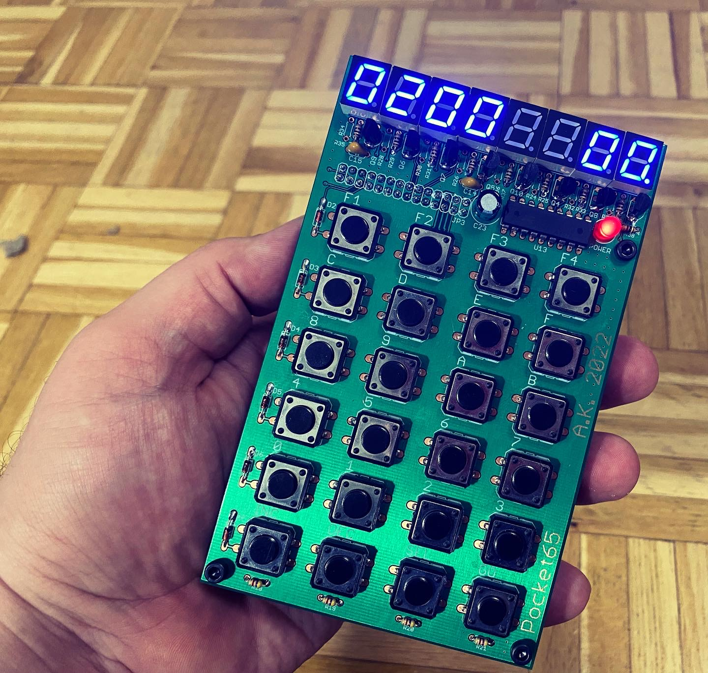

# Pocket65

Handheld PC based on the original 6502 CPU that fits into a pocket.

## Features

- 8 digit multiplexed 7-segment display,
- 24 button keyboard,
- 2 KB of ROM and 2 KB of RAM,
- built-in Li-Po power supply and charger,
- monitor FW that allows memory edit and running user programs,
- expansion slot with 3 chip selects (up to 24 KB of external I/O and/or memory).

# Memory map

| Start  | End    | Description |
|--------|--------|-------------|
| 0x0000 | 0x07FF | RAM         |
| 0x0800 | 0x1FFF | RAM aliased |
| 0x2000 | 0x3FFF | External 1  |
| 0x4000 | 0x5FFF | External 2  |
| 0x6000 | 0x7FFF | External 3  |
| 0x8000 | 0x9FFF | Screen      |
| 0xA000 | 0xBFFF | Keyboard    |
| 0xC000 | 0xDFFF | NMI ack     |
| 0xE000 | 0xF7FF | ROM aliased |
| 0xF800 | 0xFFFF | ROM         |

# Monitor how-to

## Startup

First, welcome splash-screen is displayed:

After one second memory test result is displayed:

On the right is a decimal number of RAM bytes found. By default it's 2048 bytes, memory can be expanded using expansion slot. If an error occurs during memory test, error screen is presented and the system is halted:

After 2 seconds computer proceeds to the main mode of operation:

## Memory edit

In the main mode and byte modification selected (dot near memory value) memory modification is possible. To modify memory press a key `0` to `F`. The old value is then shifted 4 binary places to the left and new nibble is inserted at the youngest position. Previous 4 oldest bits are lost.

Example - entering `0xBA` at current address:

We start with our memory cell selected (in this case at the address `0x0200`):

press `B` button to enter 0xB:

then press `A` button to finish entering the byte:

Done!

## Address selection

The address can be modified in two ways:

### INC/DEC buttons

To select next/prev memory cell press `INC`/`DEC` button. The address will be incremented/decremented by one.

### Entering new address

Big leaps through memory space are not very convenient using incrementation/decrementation. You can change the address very similar to changing memory value. To enter address edit mode pres `SEL` key. Dot will appear next to address to confirm mode selection:

In this mode address can be modified the same way memory value is performed - when key `0-F` is pressed the old address is shifted 4 bits to the left and new value is inserted at the youngest position.

To exit address edit mode (and return to the memory value edit mode) press `SEL` key.

## Executing user program

To start user program provides its entry point in the address field and press `GO` button.

## F1 key - auto increment mode

`F1` key toggles auto-increment mode. When on it's indicated by dots enabled next to both address and value:

When this mode is active when the whole byte is entered (i.e. two key `0-F` presses) address will be incremented automatically. This mode is very useful for binary program listing input, as no additional key press between bytes is needed.

## F2 key - memory clear

`F2` key clears user memory - sets it to all zeroes. Memory locations from `0x0000` to `0x000CF` and from `0x2000` to RAM end are cleared.

## F3 key - memory copy

`F3` key copies _length_ bytes from _source_ to _destination_. _Destination_ is selected as the current address. After pressing `F3` user is prompted for source address:

selection is confirmed with `GO` key. After that user is prompted for _length_:

selection is again confirmed with `GO` key. Memory is then copied and computer returns to the main screen.

## F4 key - jump to the external ROM

`F4` key allows for quick enter to the external ROM placed at address `0x6000` (external chip select #3). To detect if the external ROM is present monitor checks for a magic value at address `0x6000`. Expected value is `0x4B41` (little-endian). If this check is successful jump to external ROM at address `0x6002` is performed. Otherwise an error message is displayed:

# Programming

User program examples are provided in `fw/example` directory, along with user program template, BIOS calls user library and Makefile.

User is free to use all memory, exluding:

| Start  | End    | Description       |
|--------|--------|-------------------|
| 0x00D0 | 0x00FF | ROM ZP area       |
| 0x0100 | 0x01FF | HW stack          |
| 0x8000 | 0xDFFF | HW handled by ROM |

## Interrupts

Interrupt vectors are located in ROM area, so they cannot be changed by application code. Monitor can handle user IRQ and NMI handlers - there are two system calls to register user interrupt handler

- `svc_irq_register` register the IRQ handler,
- `svc_nmi_register` register the NMI handler.

The handler address is passed in X (low byte) and Y (high byte) registers.

Use `RTS` instruction to return from the handler insted of `RTI` - monitor handles return from the interrupt part.

## System calls

### Convention

When X, Y registers are used to pass 16-bit value, X holds low byte and Y holds high byte.

### `svc_reset`

Perform warm reset.

- Arguments: none.
- Returns: none.
- Destroys: N/A.

### `svc_irq_register`

Register user IRQ handler and enables interrupts.

- Arguments: X, Y - handler address.
- Returns: none.
- Destroys: A.

### `svc_nmi_register`

Register user NMI handler.

- Arguments: X, Y - handler address.
- Returns: none.
- Destroys: A.

### `svc_get_screen_ptr`

Return a pointer to the screen frame buffer to allow direct screen manipulation.

- Arguments: nome.
- Returns: X, Y - address.
- Destroys: none.

### `svc_putch`

Displays hex character on the screen on position X.

- Arguments: A - character, X - position
- Returns: none.
- Destroys: Y.

### `svc_putbyte`

Display a hex byte on the screen on position X. X is incremented to point on the next free screen posion.

- Arguments: A - byte, X - position
- Returns: none.
- Destroys: none.

### `svc_dot_enable`

Enable dot on the position X.

- Arguments: X - position
- Returns: none.
- Destroys: A.

### `svc_dot_disable`

Disable dot on the position X.

- Arguments: X - position
- Returns: none.
- Destroys: A.

### `svc_clear_screen`

Clear screen.

- Arguments: none.
- Returns: none.
- Destroys: A, X.

### `svc_prinx_u16`

Print 16-bit number in registers X, Y as hexadecimal number justified to the right.

- Arguments: X, Y - number.
- Returns: none.
- Destroys: A, X.

### `svc_prind_u16`

Print 16-bit number in registers X, Y as unsigned decimal number justified to the right.

- Arguments: X, Y - number.
- Returns: none.
- Destroys: A, X, Y.

### `svc_prind_s16`

Print 16-bit number in registers X, Y as signed decimal number justified to the right.

- Arguments: X, Y - number.
- Returns: none.
- Destroys: A, X, Y.

### `svc_prind_s16`

Print NULL terminated decoded 7 segment string from position A.

- Arguments: X, Y - pointer to the string, A - position on the screen.
- Returns: none.
- Destroys: A, X, Y.

### `svc_scanx_u16`

Get 16-bit unsigned number from the user (hexadecimal input).

- Arguments: none.
- Returns: X, Y - number.
- Destroys: A, X, Y.

### `svc_scand_u16`

Get 16-bit unsigned number from the user (decimal input).

- Arguments: none.
- Returns: X, Y - number.
- Destroys: A, X, Y.

### `svc_get_key`

Get key code - block until new key is pressed.

- Arguments: none.
- Returns: A - key code.
- Destroys: none.

### `svc_get_key_nb`

Get current key code.

- Arguments: none.
- Returns: A - key code.
- Destroys: none.

### `svc_get_jiffies`

Get current miliseconds value (one byte).

- Arguments: none.
- Returns: A - jiffies.
- Destroys: none.

### `svc_get_seconds`

Get current seconds value (one byte).

- Arguments: none.
- Returns: A - seconds.
- Destroys: none.

### `svc_msleep`

Sleep for 0-255 ms.

- Arguments: A - time (ms).
- Returns: none.
- Destroys: A.

### `svc_sleep`

Sleep for 0-255 s.

- Arguments: A - time (s).
- Returns: none.
- Destroys: A.

# License

Free for non-commercial use and educational purposes. See LICENSE.md for details.
